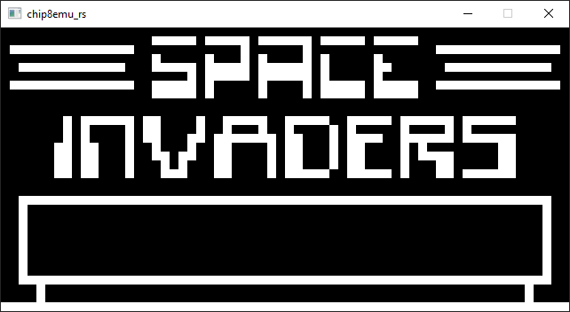
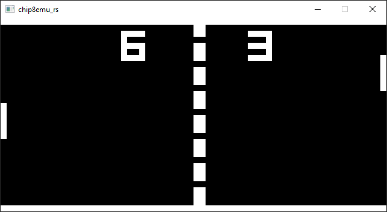

# chip8emu_rs

[](https://github.com/DasStone/chip8emu_rs)
[](https://github.com/DasStone/chip8emu_rs/main/LICENSE)

A simple chip8 emulator using SDL2.




## Help

```
chip8emu_rs 0.1.0
Adrian Stein <adrian.stein@tum.de>
Chip8 emulator

USAGE:
    chip8emu_rs.exe [FLAGS] [OPTIONS] <ROM>

FLAGS:
    -m, --mute       Mutes emulator audio
    -h, --help       Prints help information
    -v, --version    Prints version information

OPTIONS:
    -c, --clock <CLOCK>    Sets CPU clock speed (in Hz). Valid range: [300, 1000]. Default is 600
    -s, --scale <SCALE>    Scales pixel size. Valid range: [1, 100]. Default is 10
    -t, --theme <THEME>    Color theme: r, g, b, br, bg, bb, bw. Default is bw

ARGS:
    <ROM>    Filename of the chip8-program

Quit the emulator by pressing <ESC>, restart by pressing <SPACE>

Input mapping:
Emulator     Chip8
+-+-+-+-+    +-+-+-+-+
|1|2|3|4|    |1|2|3|C|
|Q|W|E|R|    |4|5|6|D|
|A|S|D|F|    |7|8|9|E|
|Z|X|C|V|    |A|0|B|F|
+-+-+-+-+    +-+-+-+-+

(The US Layout is a reference. The physical keys are used, not the values they are assigned to)
```

## Input mapping

The chip8 uses a hexadecimal keypad. The emulator assigns the left half of the keyboard as input for the emulator. The emulator uses scancodes, so only the physical key-layout matters (The US Layout is used as a reference).

```
Emulator     Chip8
+-+-+-+-+    +-+-+-+-+
|1|2|3|4|    |1|2|3|C|
|Q|W|E|R|    |4|5|6|D|
|A|S|D|F|    |7|8|9|E|
|Z|X|C|V|    |A|0|B|F|
+-+-+-+-+    +-+-+-+-+

Special Keys:
<ESC> quits the emulator
<SPACE> restarts the emulator
```

## Installation and Building

Install SDL2 in order to install/build projects using the [sdl2 crate](https://crates.io/crates/sdl2) (Use the setup instructions provided by the sdl2 crate).

### Installation

```
cargo install chip8emu_rs
```

### Building

```
git clone https://github.com/DasStone/chip8emu_rs.git
cd chip8emu_rs
cargo build --release
./target/release/chip8emu_rs --help
```

## Usage

Just provide a game file for the emulator:

```
chip8emu_rs game.ch8
```

Most roms you find will either end with ```ch8``` or ```c8```. The emulator does not actually care what the file ending is, it will just try to fit whatever file you provide into the emulated ram and then try running it.

## Helpfull Resources

I can highly recommend writing an emulator yourself. The Chip8 seems to be a good system for people getting into emulation, due to its simplicity. The following resources might help you.

Chip8 technical details:

- ["Guide to making a Chip-8 emulator" by Tobias V. Langhoff](https://tobiasvl.github.io/blog/write-a-chip-8-emulator/)
- ["Chip-8 Technical Reference" by Cowgod](http://devernay.free.fr/hacks/chip8/C8TECH10.HTM)

Chip8 test-rom:

- [Chip8 test rom by corax89](https://github.com/corax89/chip8-test-rom)

You will be able to find more resources (test-roms, games, documentation, etc.) by simply searching online (GitHub, Wikipedia, blogs, etc.).

## TODO

1. **Reliability of "beeps"**\
The system usually has ca. 1/60 sec time to produce a beep (which is on the edge of being too short for SDL2 to manage). A simple counter extends this time, but this can lead to individual beeps (in quick succession) sounding like one long beep (given the emulated cpu runs fast enough). 
2. **Custom error message on "illegal" instructions**\
The emulator will ```panic``` if an instruction tries to access illegal parts of the emulator (e.g., an out of bounds memory address). This is in general a non-issue when playing games (due to them usually being correct). However, I would like to implement a custom error message when this happens to help developers trying to create chip8 games using this emulator.
3. **Better testing**\
The system was only tested by running chip8 test-roms and games. There are currently no unit tests.
4. **Fullscreen support and dynamic resizing**
5. **Decouple CPU and TIMER timings**\
The cpu's timings are dependent on the fixed 60Hz of the timers.
